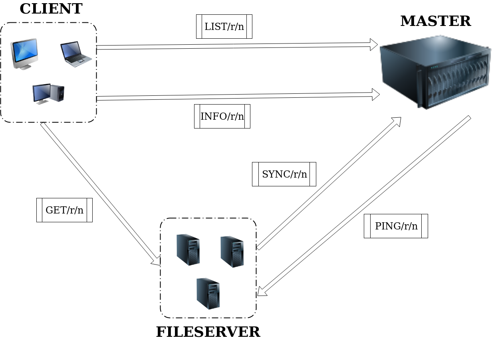
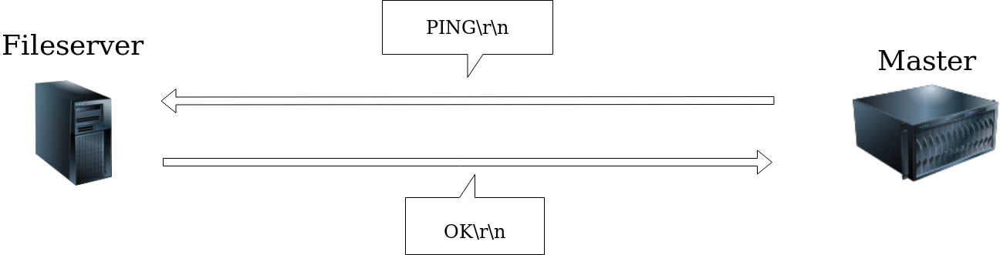
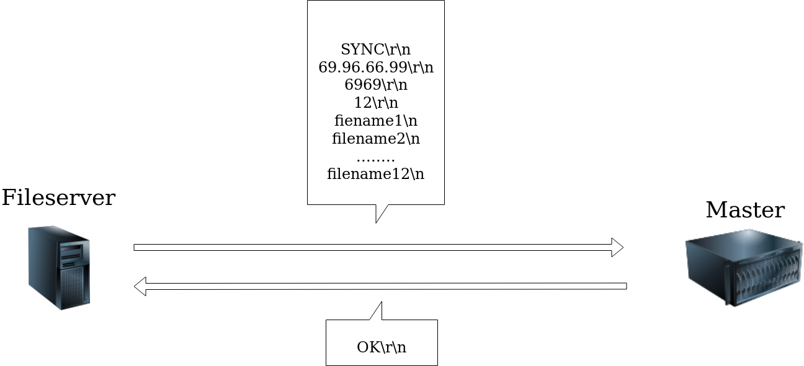
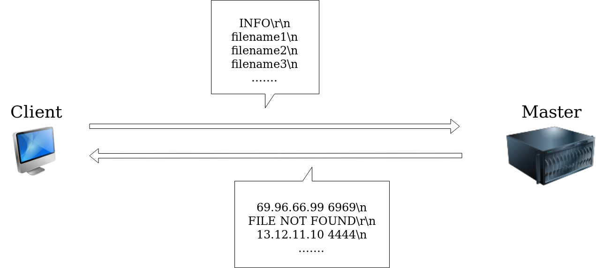
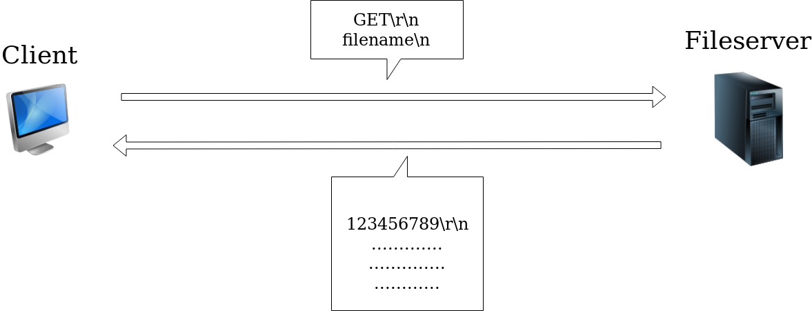
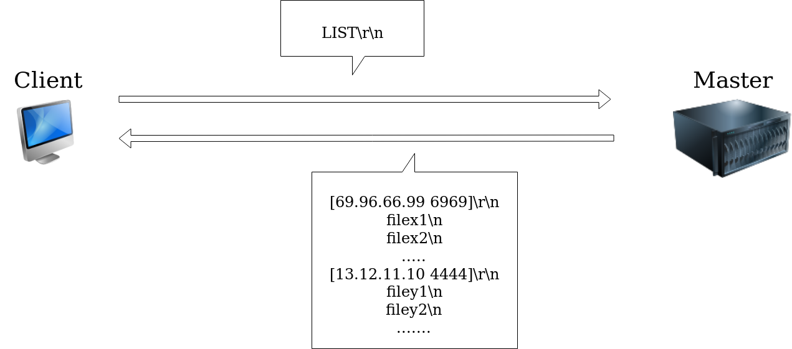
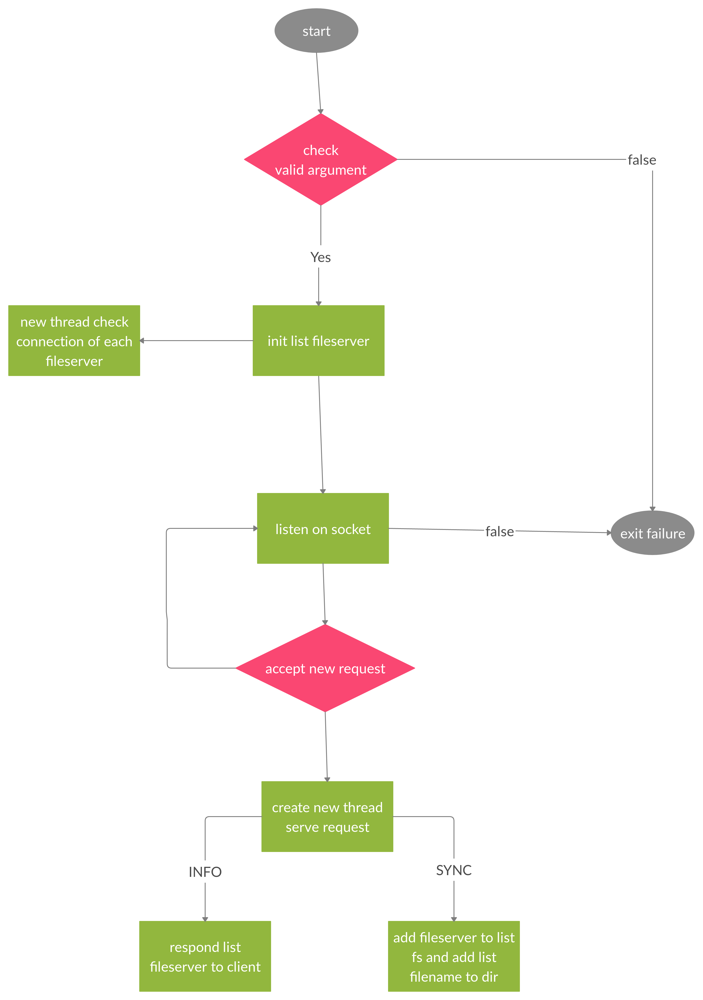
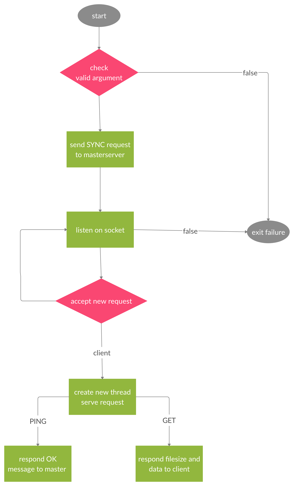
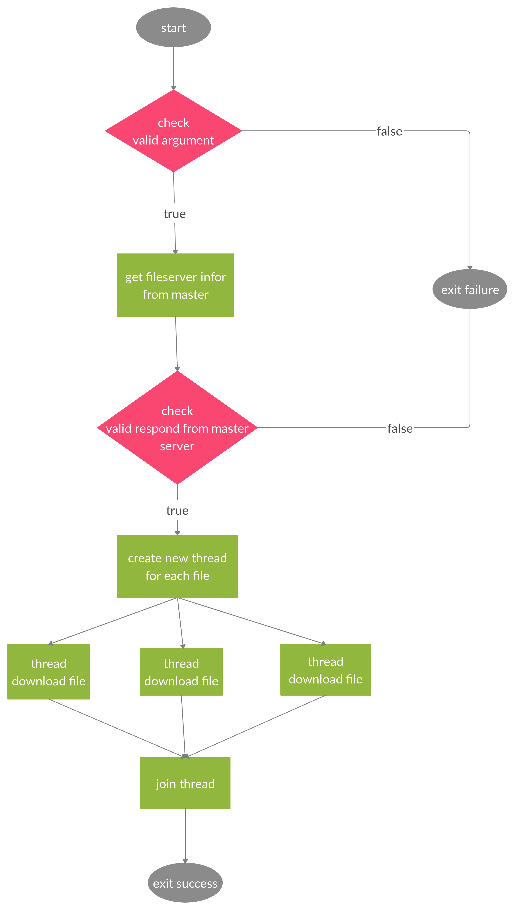

# Báo cáo đề tài ứng dụng truyền nhận file qua mạng

Thành viên nhóm

| Họ tên | Mã số sinh viên |
| :-- | :-- |
| Đoàn Khuê | 1612311 |
| Nguyễn Văn Linh | 1612340 |
| Mai Chí Cường | 1612070 |
| Phạm Trung Tín | 1612695 |

- **Mục lục**
  - [1. Đánh giá chức năng đã hoàn thành](#1-%c4%90%c3%a1nh-gi%c3%a1-ch%e1%bb%a9c-n%c4%83ng-%c4%91%c3%a3-ho%c3%a0n-th%c3%a0nh)
  - [2. Phân công việc](#2-ph%c3%a2n-c%c3%b4ng-vi%e1%bb%87c)
  - [3. Tổng quan hệ thống](#3-t%e1%bb%95ng-quan-h%e1%bb%87-th%e1%bb%91ng)
    - [3.1. Mô hình hoạt động](#31-m%c3%b4-h%c3%acnh-ho%e1%ba%a1t-%c4%91%e1%bb%99ng)
    - [3.2. Thiết kế giao thức](#32-thi%e1%ba%bft-k%e1%ba%bf-giao-th%e1%bb%a9c)
      - [3.2.1. PING method](#321-ping-method)
      - [3.2.2. SYNC method](#322-sync-method)
      - [3.2.3. INFO pmethod](#323-info-pmethod)
      - [3.2.4. GET method](#324-get-method)
      - [3.2.5. LIST method](#325-list-method)
    - [3.3. Chi tiết vận hành](#33-chi-ti%e1%ba%bft-v%e1%ba%adn-h%c3%a0nh)
      - [3.3.1 Master](#331-master)
      - [3.3.2 Fileserver](#332-fileserver)
      - [3.3.3 Client](#333-client)
  - [4. Usage](#4-usage)
  - [5. Demo](#5-demo)
  - [6. Tham khảo](#6-tham-kh%e1%ba%a3o)

## 1. Đánh giá chức năng đã hoàn thành

### 1.1. Master server

| Chức năng | Hoàn thành | Ghi chú |
| :-- | :-- | :-- |
| Có địa chỉ IP:port cố định. Chứa thông tin về các file được chia sẻ bởi file server, thông tin IP:port của file server quản lý tương ứng. | ✅ |  |
| Cung cấp service (#1) để ghi nhận thông tin mà file server gửi lên gồm: danh sách các file, IP:port của file server. | ✅ |  |
| Cung cấp service (#2) để client có thể lấy thông tin danh sách các file được chia sẻ, kèm theo IP:port của file server quản lý file. | ✅ |  |
| Cho phép nhiều client, nhiều file server kết nối tới cùng một thời điểm. | ✅ |  |

### 1.2. File server

| Chức năng | Hoàn thành | Ghi chú |
| :-- | :-- | :-- |
| Chứa các files có thể chia sẻ được với client. | ✅ |  |
| Khi file server khởi động, nó kết nối đến master server và gọi service (1) để gửi thông tin của chính nó lên file server gồm: danh sách file có thể chia sẻ, địa chỉ IP, port mà client có thể kết nối tới để tải file. | ✅ |  |
| Cung cấp service (#3) để client tải file với input là tên file cần tải. Service này sử dụng giao thức UDP tại tầng Transport. | ✅ |  |
| Cung cấp chức năng hiện danh sách file hiện có trên các file server | ✅ | Chức năng nhóm tự thêm vào |
| Cho phép nhiều client kết nối đến cùng một thời điểm. | ✅ |  |
| Khi file server ngừng hoạt động, master server cần loại bỏ danh sách file của file server tương ứng. | ✅ |  |

### 1.3. Client

| Chức năng | Hoàn thành | Ghi chú |
| :-- | :-- | :-- |
| Có thể sử dụng service (2) do master server cung cấp và service (3) do file server cung cấp. | ✅ |  |
| Có thể tải nhiều file cùng một thời điểm. | ✅ |  |

### 1.4. Các yêu cầu khác

| Chức năng | Hoàn thành | Ghi chú |
| :-- | :-- | :-- |
| Thiết kế giao thức tại tầng Application để đảm bảo file được truyền nhận theo giao thức UDP (service #3) có độ tin cậy. | ❌ | Nhóm không áp dụng UDP tin cậy được nên sử dung TCP |

## 2. Phân công việc

| Chức năng | Người thực hiện | Mã số sinh viên | Mức độ hoàn thành | Ghi chú |
| :-- | :-- | :-- | :-- | :-- |
| Master | Nguyễn Văn Linh | 1612340 | 100% |  |
| File Server | Phạm Trung Tín | 1612695 | 90% | Không triển khai được UDP tin cậy |
| Client | Đoàn Khuê | 1612311 | 90% | Không triển khai được UDP tin cậy |
| Test và ghi báo cáo | Mai Chí Cường | 1612070 | 100% |  |

Cả nhóm tham gia thiết kế giao thức.

## 3. Tổng quan hệ thống

### 3.1. Mô hình hoạt động

### 3.2. Thiết kế giao thức

#### 3.2.1. PING method

#### 3.2.2. SYNC method

#### 3.2.3. INFO pmethod

#### 3.2.4. GET method

#### 3.2.5. LIST method

### 3.3. Chi tiết vận hành

#### 3.3.1 Master
<<<<<<< HEAD

#### 3.3.2 Fileserver

#### 3.3.3 Client

---
=======

#### 3.3.2 Fileserver

#### 3.3.3 Client

>>>>>>> d0e7aa3ded49374929c348b77e8d9ac3bffbf0b8
## 4. Usage

## 5. Demo

## 6. Tham khảo
